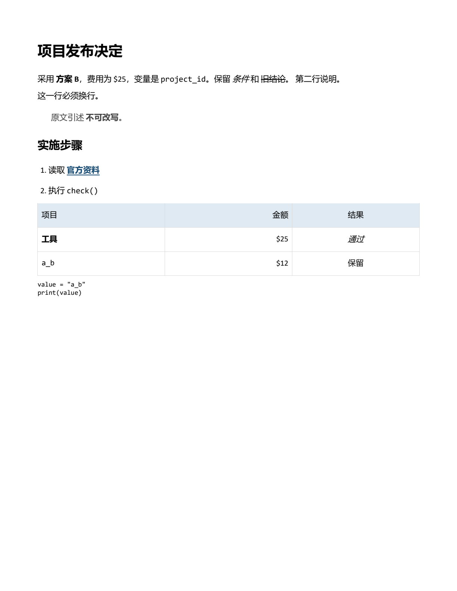
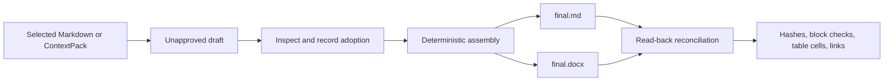

# Final Assembly

**Assemble approved Markdown blocks into final Markdown and Word files, then reconcile the actual exports against their sources.**

[简体中文](README.zh-CN.md) · [Agent Skill](skills/final-assembly/SKILL.md) · [Manifest guide](skills/final-assembly/references/manifest.md)

The last step of document production is deceptively risky. Approved paragraphs can be reordered, tables can lose cells, links can change, and a final formatting pass can quietly rewrite text. Final Assembly treats delivery as a deterministic assembly job: only approved, hashed source blocks enter the output, and the generated files are read back before they are accepted.

No model is involved in assembly or verification.

## See the output



An actual page rendered from the generated DOCX: Chinese headings, emphasis, a link, a table, and code survive the assembly. This uses the repository's [synthetic Markdown example](examples/common-markdown); the image is a document render, not a mockup.

Select material → inspect the draft → explicitly approve blocks → build Markdown and DOCX → verify the exported files. The tool preserves chosen content and reports unsupported structures instead of silently rewriting them. [Render details](docs/demo-result.json); pagination can vary with fonts and the document renderer.

## How it works



The manifest records which block was approved, where it came from, its order, its exact UTF-8 hash, and which older block it replaces. A changed source does not become approved merely because someone recalculated its hash.

## Install

Requires Python 3.11 or later. Run these commands from the cloned or extracted source directory. The commands use the virtual environment directly; activation is not required.

**macOS / Linux**

```sh
python3 -m venv .venv
.venv/bin/python -m pip install .
```

**Windows PowerShell**

```powershell
py -3 -m venv .venv
.\.venv\Scripts\python.exe -m pip install .
```

## Quick start

Try the included example from the same source directory:

**macOS / Linux**

```sh
.venv/bin/python -m final_assembly preview examples/common-markdown/manifest.json
.venv/bin/python -m final_assembly build examples/common-markdown/manifest.json --out-dir exports/first-run --summary
.venv/bin/python -m final_assembly verify exports/first-run/manifest.snapshot.json --file exports/first-run/final.docx --summary --report exports/first-verification.json
```

**Windows PowerShell**

```powershell
.\.venv\Scripts\python.exe -m final_assembly preview examples/common-markdown/manifest.json
.\.venv\Scripts\python.exe -m final_assembly build examples/common-markdown/manifest.json --out-dir exports/first-run --summary
.\.venv\Scripts\python.exe -m final_assembly verify exports/first-run/manifest.snapshot.json --file exports/first-run/final.docx --summary --report exports/first-verification.json
```

For your own materials, replace the example manifest and add `--workspace <materials-directory>` before `preview`, `build`, or `verify`. Manifest and output paths are relative to that workspace; keep invoking the virtual-environment Python shown above.

Every build uses a new output directory. Existing deliveries are never overwritten.

## Assemble your own selected materials

Place your chosen `intro.md` and `decision.md` in an existing `materials` directory. `prepare` snapshots their exact bytes into an unapproved draft, so you can inspect the material before recording an adoption decision.

**macOS / Linux**

```sh
.venv/bin/python -m final_assembly --workspace ./materials prepare intro.md decision.md --out-dir draft-v1 --title "Release brief" --origin "Selected notes"
.venv/bin/python -m final_assembly --workspace ./materials inspect draft-v1/manifest.json --full-text
.venv/bin/python -m final_assembly --workspace ./materials approve draft-v1/manifest.json --ids block-0001 block-0002 --decision "Adopt these two reviewed sections" --out-manifest draft-v1/approved.json
.venv/bin/python -m final_assembly --workspace ./materials build draft-v1/approved.json --out-dir delivery-v1 --summary
.venv/bin/python -m final_assembly --workspace ./materials verify delivery-v1/manifest.snapshot.json --file delivery-v1/final.docx --summary --report verification-v1.json
```

**Windows PowerShell:** use `.\.venv\Scripts\python.exe` in place of `.venv/bin/python` in the commands above. Run from the source directory, or use the absolute path to that same virtual-environment Python if you change directories.

Use `approve` only for the active block IDs you have actually chosen, and replace the sample decision with your actual instruction. An existing explicit adoption instruction can be recorded directly. Approval writes a new manifest and binds the decision to the source hash; it does not rewrite the draft or fix source drift. Existing manifests with boolean approval remain compatible.

`inspect` can succeed with exit `0` while `ready_to_build` is `false`: inspect the pending approvals and issues. Unapproved active blocks still prevent `build`. Use `preview` for a manifest that is already ready to assemble.

`--summary` returns a compact receipt with a `report_file` path; the complete evidence stays on disk. It is optional, and omitting it retains the full JSON output. `verify --summary` requires a new `--report` file so detailed evidence is not lost.

## Delivery bundle

| File | Purpose |
| --- | --- |
| `final.md` | Exact approved Markdown blocks in the declared order |
| `final.docx` | Word rendering with supported document structure and styling |
| `manifest.snapshot.json` | Frozen approval and source record used for verification |
| `sources/` | Current and historical source snapshots for portable rechecking |
| `reconciliation.json` | Hashes and block, table-cell, formatting, and link results |

The final files appear only after both exports have been written and read back successfully. Exit code `0` means the requested operation succeeded; for `build` and `verify`, reconciliation passed. Exit `2` means input or environment error, and `3` means a generated file did not reconcile. Inspection success is not an approval decision.

## Supported document content

Final Assembly supports common delivery-oriented Markdown:

- ATX and Setext headings, paragraphs, soft and explicit line breaks;
- bold, italic, strikethrough, inline code, and absolute HTTP(S)/mailto links;
- single-level ordered and unordered lists;
- block quotes and fenced or indented code blocks;
- rectangular pipe tables with alignment, escaped pipes, and empty cells.

The Markdown bytes are preserved in `final.md`. The DOCX verifier compares the normalized document structure after rendering. Unsupported constructs are rejected or handled as plain CommonMark text instead of being silently approximated.

Images, nested lists or quotes, merged table cells, formulas, raw HTML, relative links, empty-label links, and arbitrary Word-document import are outside the assembly contract. Content reconciliation also does not replace a visual, page-by-page layout review when layout is part of acceptance.

## Agent Skill and ContextPack import

[`skills/final-assembly/SKILL.md`](skills/final-assembly/SKILL.md) helps an agent maintain approval decisions, replacement history, and recovery rules while using the same CLI.

`import-pack` converts a ContextPack into source files and a manifest draft while preserving each `exactText` and its provenance. Imported blocks begin unapproved so the handoff cannot silently become a publication decision.

```sh
.venv/bin/python -m final_assembly --workspace ./materials import-pack context-pack.json --out-dir imported-v1
.venv/bin/python -m final_assembly --workspace ./materials inspect imported-v1/manifest.json --full-text
```

On Windows, use the same `.\.venv\Scripts\python.exe` interpreter as above. Continue with `approve` using the imported IDs returned by `inspect`, then build the new approved manifest.

- `excerptHash` verifies the selected UTF-8 text; `sourceHash` is retained as the full-message hash. A partial excerpt cannot verify an unseen full message or authenticate its author.
- Selection ranges use UTF-16 code units. Unknown source IDs stay `null`; `app-server`, `imported-transcript`, and `codex-rollout` origins are supported.
- Legacy full-message packs without `excerptHash` use an explicit compatibility policy and retain their original metadata. Ambiguous or partial legacy packs must be re-exported with `excerptHash` and a valid range. Do not replace `sourceHash` with a fragment hash to make an import pass.

## Safety model

- All materials and outputs must remain inside the selected workspace.
- Path traversal and out-of-bound symlinks or junctions are rejected.
- Source hashes prove byte equality with the approved record; they are not identity signatures.
- Output directories are append-only by convention and never replaced by `build`.
- Assembly is deterministic and offline; there are no model keys or network calls.

## Contributing

```sh
.venv/bin/python scripts/validate.py
```

On Windows PowerShell:

```powershell
.\.venv\Scripts\python.exe scripts/validate.py
```

Issues and pull requests are welcome for additional deterministic Markdown structures, clearer reconciliation evidence, and portable document output.

Licensed under the [MIT License](LICENSE). Third-party Python packages retain their own licenses.
