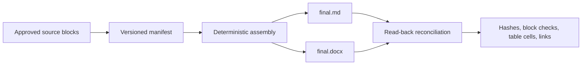

# Final Assembly

**Assemble approved Markdown blocks into final Markdown and Word files, then reconcile the actual exports against their sources.**

[简体中文](README.zh-CN.md) · [Agent Skill](skills/final-assembly/SKILL.md) · [Manifest guide](skills/final-assembly/references/manifest.md)

The last step of document production is deceptively risky. Approved paragraphs can be reordered, tables can lose cells, links can change, and a final formatting pass can quietly rewrite text. Final Assembly treats delivery as a deterministic assembly job: only approved, hashed source blocks enter the output, and the generated files are read back before they are accepted.

No model is involved in assembly or verification.

## How it works



The manifest records which block was approved, where it came from, its order, its exact UTF-8 hash, and which older block it replaces. A changed source does not become approved merely because someone recalculated its hash.

## Install

Requires Python 3.11 or later.

```sh
python -m venv .venv
.venv/bin/python -m pip install /path/to/final-assembly
```

On Windows, use `.venv\Scripts\python.exe` and `.venv\Scripts\final-assembly.exe`.

## Quick start

```sh
final-assembly --workspace /your/materials preview manifest.json
final-assembly --workspace /your/materials build manifest.json --out-dir delivery-v1
final-assembly --workspace /your/materials verify delivery-v1/manifest.snapshot.json --file delivery-v1/final.docx
```

Try the included example from a source checkout:

```sh
python -m final_assembly build examples/common-markdown/manifest.json --out-dir exports/first-run
```

Every build uses a new output directory. Existing deliveries are never overwritten.

## Delivery bundle

| File | Purpose |
| --- | --- |
| `final.md` | Exact approved Markdown blocks in the declared order |
| `final.docx` | Word rendering with supported document structure and styling |
| `manifest.snapshot.json` | Frozen approval and source record used for verification |
| `sources/` | Current and historical source snapshots for portable rechecking |
| `reconciliation.json` | Hashes and block, table-cell, formatting, and link results |

The final files appear only after both exports have been written and read back successfully. Exit code `0` means reconciliation passed, `2` means input or environment error, and `3` means a generated file did not reconcile.

## Supported document content

Final Assembly supports common delivery-oriented Markdown:

- ATX and Setext headings, paragraphs, soft and explicit line breaks;
- bold, italic, strikethrough, inline code, and absolute HTTP(S)/mailto links;
- single-level ordered and unordered lists;
- block quotes and fenced or indented code blocks;
- rectangular pipe tables with alignment, escaped pipes, and empty cells.

The Markdown bytes are preserved in `final.md`. The DOCX verifier compares the normalized document structure after rendering. Unsupported constructs are rejected or handled as plain CommonMark text instead of being silently approximated.

Images, nested lists or quotes, merged table cells, formulas, raw HTML, relative links, and arbitrary Word-document import are outside the assembly contract. Content reconciliation also does not replace a visual, page-by-page layout review when layout is part of acceptance.

## Agent Skill and ContextPack import

[`skills/final-assembly/SKILL.md`](skills/final-assembly/SKILL.md) helps an agent maintain approval decisions, replacement history, and recovery rules while using the same CLI.

`import-pack` converts a ContextPack into source files and a manifest draft while preserving each `exactText` and its provenance. Imported blocks begin unapproved so the handoff cannot silently become a publication decision.

## Safety model

- All materials and outputs must remain inside the selected workspace.
- Path traversal and out-of-bound symlinks or junctions are rejected.
- Source hashes prove byte equality with the approved record; they are not identity signatures.
- Output directories are append-only by convention and never replaced by `build`.
- Assembly is deterministic and offline; there are no model keys or network calls.

## Contributing

```sh
python scripts/validate.py
```

Issues and pull requests are welcome for additional deterministic Markdown structures, clearer reconciliation evidence, and portable document output.

Licensed under the [MIT License](LICENSE). Third-party Python packages retain their own licenses.
