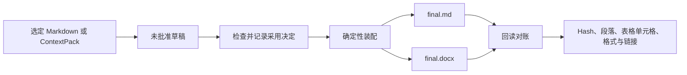

# Final Assembly · 定稿装配

**把已经批准的 Markdown 内容装配成最终 Markdown 与 Word 文件，并对实际导出文件进行逐项对账。**

[English](README.md) · [Agent Skill](skills/final-assembly/SKILL.md) · [Manifest 说明](skills/final-assembly/references/manifest.md)

文档交付的最后一步很容易出现隐蔽错误：批准过的段落被换序、表格丢格、链接改变，或者最后一次排版顺手改写了正文。Final Assembly 把定稿视为确定性的装配任务：只有已批准并记录 hash 的源块可以进入输出，生成的文件还必须重新读取并与来源对账。

装配和核验过程完全不使用模型。

## 看实际输出


这是生成的 DOCX 的实际渲染页：中文标题、强调样式、链接、表格和代码均保留。材料来自仓库内的[合成 Markdown 示例](examples/common-markdown)，不是界面效果图。

选材料 → 检查草稿 → 明确批准片段 → 输出 Markdown 与 DOCX → 核验导出文件。工具保留选中的内容，遇到不支持的结构会明确报告。[渲染说明](docs/demo-result.json)；不同字体和文档渲染器可能影响分页。

## 工作方式



Manifest 记录批准了哪个内容块、它来自哪里、排列顺序、原始 UTF-8 hash，以及它替换了哪个旧块。源文发生变化时，单纯重新计算 hash 不会让新内容自动获得批准。

## 安装

需要 Python 3.11 或更高版本。在克隆或解压后的源码目录中运行以下命令；命令直接调用虚拟环境，无需先激活。

**macOS / Linux**

```sh
python3 -m venv .venv
.venv/bin/python -m pip install .
```

**Windows PowerShell**

```powershell
py -3 -m venv .venv
.\.venv\Scripts\python.exe -m pip install .
```

## 快速开始

在同一个源码目录中体验内置示例：

**macOS / Linux**

```sh
.venv/bin/python -m final_assembly preview examples/common-markdown/manifest.json
.venv/bin/python -m final_assembly build examples/common-markdown/manifest.json --out-dir exports/first-run --summary
.venv/bin/python -m final_assembly verify exports/first-run/manifest.snapshot.json --file exports/first-run/final.docx --summary --report exports/first-verification.json
```

**Windows PowerShell**

```powershell
.\.venv\Scripts\python.exe -m final_assembly preview examples/common-markdown/manifest.json
.\.venv\Scripts\python.exe -m final_assembly build examples/common-markdown/manifest.json --out-dir exports/first-run --summary
.\.venv\Scripts\python.exe -m final_assembly verify exports/first-run/manifest.snapshot.json --file exports/first-run/final.docx --summary --report exports/first-verification.json
```

处理自己的材料时，替换示例 Manifest，并在 `preview`、`build` 或 `verify` 前加入 `--workspace <材料目录>`。Manifest 和输出路径均相对此 workspace 解析，仍使用上述虚拟环境 Python 调用。

每次 build 都使用新的输出目录，不会覆盖已有交付。

## 装配自己选定的材料

把选定的 `intro.md` 和 `decision.md` 放入已有的 `materials` 目录。`prepare` 将原始字节保存为未批准草稿，方便先检查材料，再记录采用决定。

**macOS / Linux**

```sh
.venv/bin/python -m final_assembly --workspace ./materials prepare intro.md decision.md --out-dir draft-v1 --title "发布说明" --origin "选定笔记"
.venv/bin/python -m final_assembly --workspace ./materials inspect draft-v1/manifest.json --full-text
.venv/bin/python -m final_assembly --workspace ./materials approve draft-v1/manifest.json --ids block-0001 block-0002 --decision "采用这两段已审阅内容" --out-manifest draft-v1/approved.json
.venv/bin/python -m final_assembly --workspace ./materials build draft-v1/approved.json --out-dir delivery-v1 --summary
.venv/bin/python -m final_assembly --workspace ./materials verify delivery-v1/manifest.snapshot.json --file delivery-v1/final.docx --summary --report verification-v1.json
```

**Windows PowerShell：**将以上命令中的 `.venv/bin/python` 换成 `.\.venv\Scripts\python.exe`。从源码目录运行；如果切换目录，使用同一个虚拟环境 Python 的绝对路径。

只对实际选定的有效内容块调用 `approve`，并把示例决定换成真实采用指令。用户已经明确表达的采用决定可以直接记录。批准会写入新 Manifest，将决定绑定到源文 hash；不会覆盖草稿或修补源文漂移。已有仅使用布尔批准字段的 Manifest 仍兼容。

`inspect` 退出 `0` 时，`ready_to_build` 仍可能为 `false`：需要查看待批准块与问题。未批准的有效块仍会阻止 `build`；已准备好的清单可以通过 `preview` 查看装配顺序。

`--summary` 返回含 `report_file` 路径的简短回执，完整证据保留在磁盘中；省略该参数仍输出完整 JSON。`verify --summary` 必须指定新的 `--report` 文件，确保详细证据留存。

## 交付包内容

| 文件 | 作用 |
| --- | --- |
| `final.md` | 按声明顺序保存批准块的原始 Markdown |
| `final.docx` | 包含受支持文档结构与样式的 Word 文件 |
| `manifest.snapshot.json` | 用于复验的批准记录与来源快照 |
| `sources/` | 当前和历史源文快照，便于整体搬移后继续核验 |
| `reconciliation.json` | Hash，以及段落、表格单元格、格式和链接的检查结果 |

只有两份最终文件都成功写入并回读通过后，交付文件才会出现。退出码 `0` 表示所请求的操作成功；对 `build` 和 `verify`，它表示对账通过。`2` 表示输入或环境错误，`3` 表示生成文件未通过对账。检查成功不等于批准内容。

## 支持的文档内容

Final Assembly 支持常见的交付型 Markdown：

- ATX／Setext 标题、段落、软换行和显式换行；
- 粗体、斜体、删除线、行内代码和绝对 HTTP(S)／mailto 链接；
- 单层有序与无序列表；
- 引用块、围栏代码块和缩进代码块；
- 带对齐、转义竖线和空单元格的矩形 pipe 表格。

`final.md` 会保留 Markdown 原始字节。DOCX 核验比较渲染后的标准化文档结构。不支持的结构会被拒绝，或按 CommonMark 普通文本处理，不会静默猜测近似格式。

图片、嵌套列表或引用、合并单元格、公式、原始 HTML、相对链接、空标签链接和任意 Word 文档导入不在装配合同内。内容对账也不能替代对具体交付文件逐页进行的视觉排版检查。

## Agent Skill 与 ContextPack 导入

[`skills/final-assembly/SKILL.md`](skills/final-assembly/SKILL.md) 帮助 Agent 保存批准决定、替换历史和错误恢复规则，并调用同一套 CLI。

`import-pack` 可以把 ContextPack 转成源文件和 Manifest 草稿，同时保留每条 `exactText` 及其来源。导入块默认未批准，避免一次上下文交接被静默当成发布决定。

```sh
.venv/bin/python -m final_assembly --workspace ./materials import-pack context-pack.json --out-dir imported-v1
.venv/bin/python -m final_assembly --workspace ./materials inspect imported-v1/manifest.json --full-text
```

Windows 使用前述同一个 `.\.venv\Scripts\python.exe`。之后按 `inspect` 返回的导入块 ID 记录采用决定，再对新的已批准 Manifest 执行 build。

- `excerptHash` 校验所选原文的 UTF-8 字节；`sourceHash` 保留为整条消息的 hash。只有片段时，无法核验未提供的完整消息，也不能认证作者身份。
- 选区范围使用 UTF-16 单元。未知来源 ID 保留为 `null`，支持 `app-server`、`imported-transcript` 和 `codex-rollout`。
- 缺少 `excerptHash` 的旧版完整消息包使用明确兼容策略并保留原元数据。模糊或局部旧包需要重新导出，包含 `excerptHash` 和有效范围；不能把 `sourceHash` 改成片段 hash 来强行通过。

## 安全边界

- 所有材料和输出都必须位于用户选择的 workspace 内。
- 路径逃逸和越界 symlink／junction 会被拒绝。
- 源文 hash 证明字节与批准记录一致，但不是身份签名。
- `build` 不会替换已有输出目录。
- 装配过程确定、离线，不需要模型密钥或网络请求。

## 参与贡献

```sh
.venv/bin/python scripts/validate.py
```

Windows PowerShell 使用：

```powershell
.\.venv\Scripts\python.exe scripts/validate.py
```

欢迎围绕更多确定性 Markdown 结构、更清楚的对账证据和更便携的文档输出提交 Issue 或 PR。

本项目采用 [MIT License](LICENSE)，第三方 Python 包保留其各自许可证。
