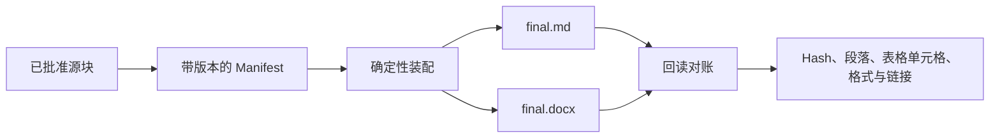

# Final Assembly · 定稿装配

**把已经批准的 Markdown 内容装配成最终 Markdown 与 Word 文件，并对实际导出文件进行逐项对账。**

[English](README.md) · [Agent Skill](skills/final-assembly/SKILL.md) · [Manifest 说明](skills/final-assembly/references/manifest.md)

文档交付的最后一步很容易出现隐蔽错误：批准过的段落被换序、表格丢格、链接改变，或者最后一次排版顺手改写了正文。Final Assembly 把定稿视为确定性的装配任务：只有已批准并记录 hash 的源块可以进入输出，生成的文件还必须重新读取并与来源对账。

装配和核验过程完全不使用模型。

## 工作方式



Manifest 记录批准了哪个内容块、它来自哪里、排列顺序、原始 UTF-8 hash，以及它替换了哪个旧块。源文发生变化时，单纯重新计算 hash 不会让新内容自动获得批准。

## 安装

需要 Python 3.11 或更高版本。

```sh
python -m venv .venv
.venv/bin/python -m pip install /path/to/final-assembly
```

Windows 使用 `.venv\Scripts\python.exe` 和 `.venv\Scripts\final-assembly.exe`。

## 快速开始

```sh
final-assembly --workspace /your/materials preview manifest.json
final-assembly --workspace /your/materials build manifest.json --out-dir delivery-v1
final-assembly --workspace /your/materials verify delivery-v1/manifest.snapshot.json --file delivery-v1/final.docx
```

从源码目录体验内置示例：

```sh
python -m final_assembly build examples/common-markdown/manifest.json --out-dir exports/first-run
```

每次 build 都使用新的输出目录，不会覆盖已有交付。

## 交付包内容

| 文件 | 作用 |
| --- | --- |
| `final.md` | 按声明顺序保存批准块的原始 Markdown |
| `final.docx` | 包含受支持文档结构与样式的 Word 文件 |
| `manifest.snapshot.json` | 用于复验的批准记录与来源快照 |
| `sources/` | 当前和历史源文快照，便于整体搬移后继续核验 |
| `reconciliation.json` | Hash，以及段落、表格单元格、格式和链接的检查结果 |

只有两份最终文件都成功写入并回读通过后，交付文件才会出现。退出码 `0` 表示对账通过，`2` 表示输入或环境错误，`3` 表示生成文件未通过对账。

## 支持的文档内容

Final Assembly 支持常见的交付型 Markdown：

- ATX／Setext 标题、段落、软换行和显式换行；
- 粗体、斜体、删除线、行内代码和绝对 HTTP(S)／mailto 链接；
- 单层有序与无序列表；
- 引用块、围栏代码块和缩进代码块；
- 带对齐、转义竖线和空单元格的矩形 pipe 表格。

`final.md` 会保留 Markdown 原始字节。DOCX 核验比较渲染后的标准化文档结构。不支持的结构会被拒绝，或按 CommonMark 普通文本处理，不会静默猜测近似格式。

图片、嵌套列表或引用、合并单元格、公式、原始 HTML、相对链接和任意 Word 文档导入不在装配合同内。内容对账也不能替代对具体交付文件逐页进行的视觉排版检查。

## Agent Skill 与 ContextPack 导入

[`skills/final-assembly/SKILL.md`](skills/final-assembly/SKILL.md) 帮助 Agent 保存批准决定、替换历史和错误恢复规则，并调用同一套 CLI。

`import-pack` 可以把 ContextPack 转成源文件和 Manifest 草稿，同时保留每条 `exactText` 及其来源。导入块默认未批准，避免一次上下文交接被静默当成发布决定。

## 安全边界

- 所有材料和输出都必须位于用户选择的 workspace 内。
- 路径逃逸和越界 symlink／junction 会被拒绝。
- 源文 hash 证明字节与批准记录一致，但不是身份签名。
- `build` 不会替换已有输出目录。
- 装配过程确定、离线，不需要模型密钥或网络请求。

## 参与贡献

```sh
python scripts/validate.py
```

欢迎围绕更多确定性 Markdown 结构、更清楚的对账证据和更便携的文档输出提交 Issue 或 PR。

本项目采用 [MIT License](LICENSE)，第三方 Python 包保留其各自许可证。
